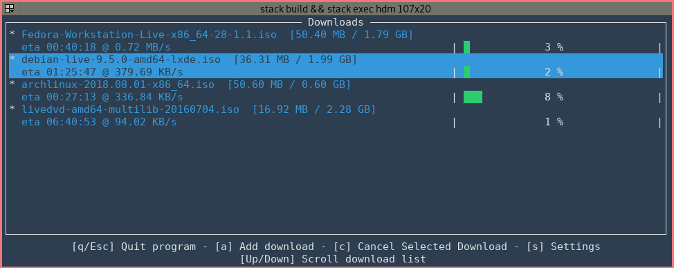

# hdm: Haskell Download Manager

A download manager for in the terminal, that supports multi-part download acceleration, and is written in Haskell.

## Building
To compile and run the download manager execute the following.

```
stack build
stack exec hdm
```

## Screenshot

